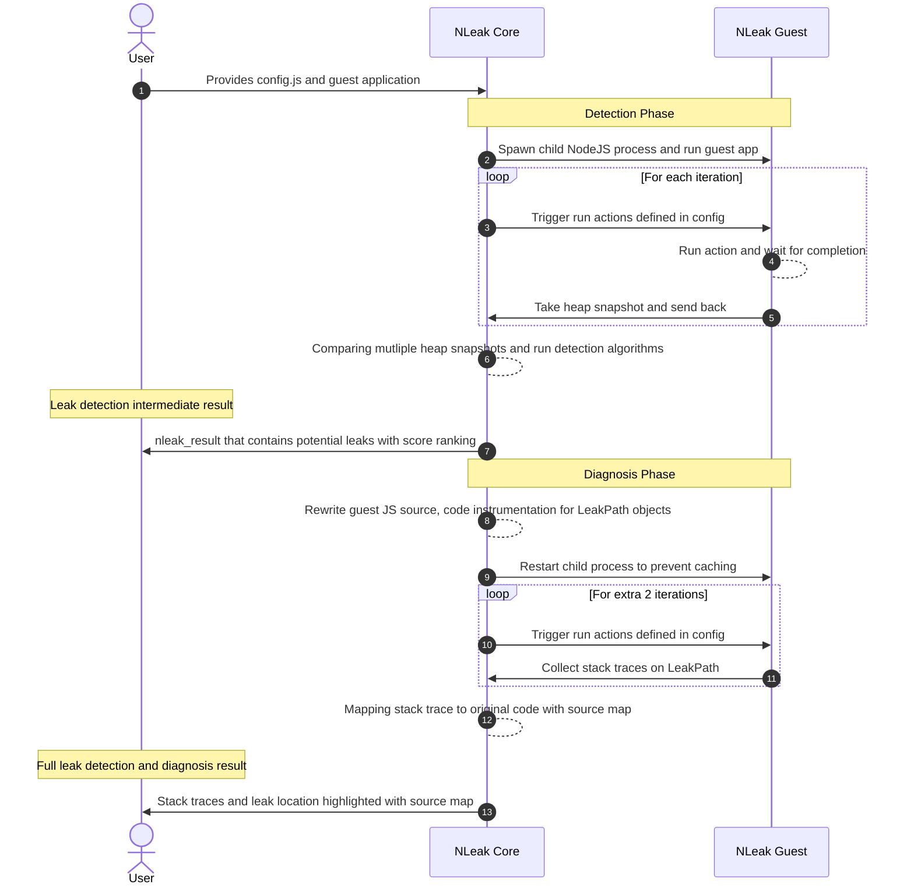

# N-Leak

> **Warning**
> NLeak is currently under development and is not ready for production use.

NLeak is an automated tool designed for detecting and diagnosing memory leaks in Node.js applications. It builds upon BLeak, a tool for identifying memory leaks in JavaScript applications, to offer a streamlined and flexible solution. NLeak aims to be lightweight and easily integrable into current CI/CD workflows. Please note that NLeak is still in development and is not yet suitable for production environments.

## Background

Memory leaks often lead to system memory exhaustion, causing performance issues or crashes. Detecting and resolving memory leaks in JavaScript can be particularly tricky due to the language’s dynamic typing, which differs from statically typed languages like C, C++, and Java. Currently, there are no automated tools specifically designed to effectively identify memory leaks in JavaScript applications running in the Node.js environment. To address this, the team is enhancing BLeak to support Node.js, with the goal of developing a tool that automates the detection, diagnosis, and prioritization of memory leaks in Node.js applications.

## How to use it?

You can clone NLeak from github and run it on your NodeJS application.

`git clone https://github.com/nodeexcel/N-Leak.git`
`cd N-Leak`
`npm i`


Then, you will need the config file to tell NLeak how to run your application. The config file should be named `config.js` and should be in the root directory of your application. Please refer to the `example` folder for an example config file and guest NodeJS application with memory leak.

Once you have the files prepared, you can run NLeak on your application by simply running the following command:

```
// go to ./example folder
nleak run --config ./config.js --guest-app-entry ./app.js --out ./
```

As a result, you will get a `nleak_result.json` file in the current directory. This file contains the memory leak detection result. You can also use the NLeak viewer to visualize the result.

## System Overview


The above figure demonstrates the execution process of NLeak. The guest application is executed as a child process in inspection mode, and heap snapshots are captured using the Chrome debugger protocol. In the leak diagnosis phase, guest application rewrites are applied to obtain the reference stack trace for potential memory leak objects. This rewrite enables traceability of object references in the guest application's execution and is seamlessly integrated into the system through a customized module import and compile scheme.

From the client's perspective, they only need to provide a configuration file and their guest application to execute NLeak. The memory leak detection results will be stored in a result file. NLeak also includes a viewer for better interpretation of the results on a web frontend.

## How NLeak Works

NLeak utilizes the core algorithm from BLeak [1] to identify memory leaks. This algorithm takes a series of JavaScript runtime heap snapshots during idempotent operations in the guest application. Memory leaks are identified as heap objects that gain more outgoing references across the heap snapshots. Once leak-related objects are gathered, NLeak re-executes the guest application to collect the related JavaScript stack trace. A visual representation of this process can be seen in following sequence diagram.



NLeak viewer is a tool built in reactjs that allows you to visualize the heap snapshot growth of your application. To use it, simply go to https://nleak-viewer.vercel.app/ and upload your nleak_result.json file.

Once you've uploaded the file, NLeak viewer will generate a chart showing the growth of your heap snapshots over time. You'll also see a summary of the last heap snapshot's size, as well as the leak location with source map.

By using NLeak with the viewer, you can easily identify potential memory leaks in your application and take steps to fix them.


## Development

### Local Development
- `npm i`
- `npm run dev`

The `dev` script will start `nodemon` to monitor all TypeScript changes and compile
them into JavaScript and put to `build` folder.

For local testing, currently we support driver tests. Simply run `npm run test:driver`.
