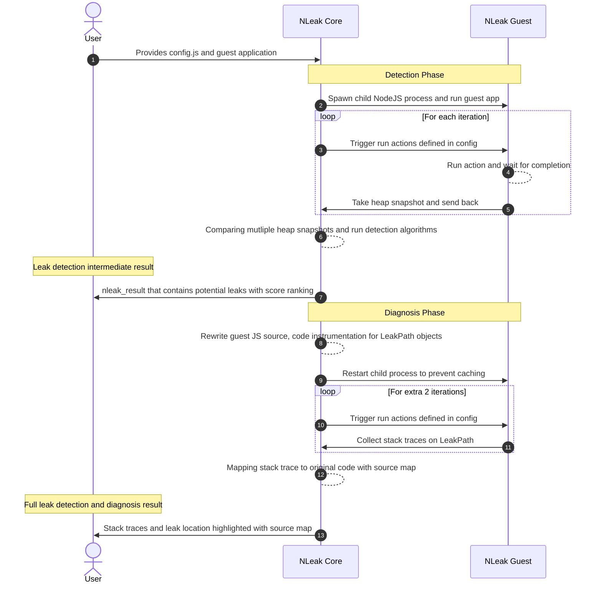

## Core & Guest NodeJS process interaction overview

### Sequence Diagram

```mermaid
sequenceDiagram
  autonumber
  actor User
  participant NLeak Core
  participant NLeak Guest
  User->>NLeak Core: Provides config.js and guest application
  Note over NLeak Core, NLeak Guest: Detection Phase
  NLeak Core->>NLeak Guest: Spawn child NodeJS process and run guest app
  loop For each iteration
    NLeak Core->>NLeak Guest: Trigger run actions defined in config
    NLeak Guest-->NLeak Guest: Run action and wait for completion
    NLeak Guest->>NLeak Core: Take heap snapshot and send back
  end
  NLeak Core-->NLeak Core: Comparing mutliple heap snapshots and run detection algorithms
  Note over User: Leak detection intermediate result
  NLeak Core->>User: nleak_result that contains potential leaks with score ranking
  Note over NLeak Core, NLeak Guest: Diagnosis Phase
  NLeak Core-->NLeak Core: Rewrite guest JS source, code instrumentation for LeakPath objects
  NLeak Core->>NLeak Guest: Restart child process to prevent caching
  loop For extra 2 iterations
    NLeak Core->>NLeak Guest: Trigger run actions defined in config
    NLeak Guest->>NLeak Core: Collect stack traces on LeakPath
  end
  NLeak Core-->NLeak Core: Mapping stack trace to original code with source map
  Note over User: Full leak detection and diagnosis result
  NLeak Core->>User: Stack traces and leak location highlighted with source map
```